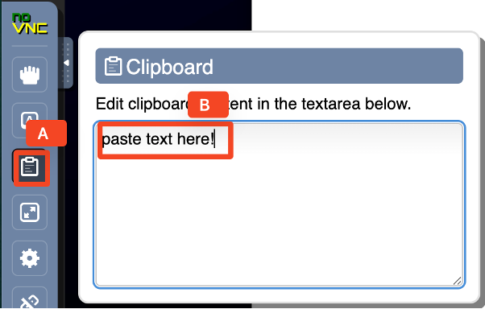

# Hands-on Setup Guide

## 1 Introduction

This demo environment setup script walks through the prerequisite steps to set up the demo environment for doing the **Deploy Java App to OpenShift Container Platform (OCP)** demo.

---

## 2 Reserve Demo Environment

The demo environment runs in IBM Cloud. You can reserve the environment by using the following steps:

1. **Launch the IBM Technology Zone Create a reservation URL.**  
   Use your IBM ID to log in to the IBM Technology Zone; the **Create a reservation** page is displayed.

2. **Select “Reserve now” (A).**  
     
   *Figure 1. The “Create a reservation” page—click the radio button labeled “A” (Reserve now).*

3. **Follow the on-screen dialog to reserve an environment in an IBM Cloud data center in the closest Geography** (US-Central, EMEA, Asia Pacific). Fill in the fields as follows:  
   - **Accept the default environment name**: _Liberty Container Deployment with CP4Apps on OpenShift_  
   - **Purpose**: Select **Education**  
   - **Description**: Enter a short, meaningful description (this field is required)  
   - **Preferred Geography**: Choose the IBM Cloud data center closest to you (e.g., US, EMEA, or Asia Pacific)  
   - **End date and time**:  
     1. Use the calendar widget to select the maximum date available.  
     2. Select a time of day for the reservation to expire.  
     3. Choose the timezone nearest to you.  
   - **VPN Access**: From the “VPN Access” dropdown, select **Enable**  

4. **Review & Submit**  
   After entering all of the fields above, **check the Agreement box (A)** and click the **Submit (B)** button.  
     
   *Figure 2. Check the Agreement checkbox (A) and click Submit (B).*

5. **Monitor Your Reservation Status**  
   The reservation takes a moment to be created. To check its status:  
   - Click **My Library (A)**, then select **My Reservations (B)**.  
       
     *Figure 3. Navigate to “My Library,” then “My Reservations.”*  
   - You will see your reservation in **“Provisioning”** status.  
       
     *Figure 4. The reservation status is shown as “Provisioning.”*  
   - It might take up to 15 minutes for the demo environment to finish provisioning. Once complete, the status changes to **“Ready.”**  
       
     *Figure 5. When provisioning is finished, status changes to “Ready.”*

---

## 3 Access the Demo Environment

Once your reservation status is **“Ready,”** proceed to access the VM:

1. **Click the Reservation icon (A)** to go to the reservation’s Details page.  
     
   *Figure 6. Click the Reservation icon to open the Details page.*

2. **In the reservation Details page, click the Workstation VM (A) URL link** to open it in a new browser window.  
     
   *Figure 7. Click the Workstation VM link to access the VM console.*

3. **Click the `vnc.html` (A) link** in the VM console.  
     
   *Figure 8. Click “vnc.html” to open the noVNC viewer.*

4. **Click the Connect (A) button** to initiate a VNC session.  
     
   *Figure 9. Click “Connect” to start your VNC session.*

5. **Enter the password as `passw0rd` (A)**, then click the **Send Credentials (B)** button.  
   > **Note:** That is a numeric zero in `passw0rd`.  
     
   *Figure 10. Enter the VNC password (passw0rd) and click “Send Credentials.”*

6. **Once you log in to the demo VM, you will see the Desktop**, which contains all the programs you need (browsers, terminal, etc.).  
     
   *Figure 11. The Demo VM desktop, ready for use.*

---

## 4 Tips for Working in the Demo Environment

### 4.1 Resizing the Virtual Desktop

By default, the noVNC viewer may not fill your entire screen. To resize the viewable area:

1. **From the demo VM, expand the noVNC control pane (A)** to open the menu.  
     
   *Figure 12. Click the icon to expand the noVNC control pane.*

2. **Click Settings (A)**, then choose **Remote Resizing (B)** from the **Scaling Mode** dropdown.  
     
   *Figure 13. Enable “Remote Resizing” to fit the virtual desktop to your window.*

### 4.2 Copy & Paste via Clipboard

To copy text out of this guide and paste it into the demo VM:

1. **Copy** the text you want from your local machine (e.g., a command or code snippet).
2. **In the noVNC viewer, click the Clipboard (A) icon** to open the noVNC Clipboard window.  
     
   *Figure 14. Click the “Clipboard” icon to open the noVNC Clipboard.*  
3. **Paste** the copied text into the noVNC Clipboard (B).  
4. **Switch to the VM (e.g., a terminal window, text editor, or browser)** and paste normally (Ctrl+V).  
5. **Close the noVNC Clipboard** by clicking the clipboard icon again.

---

## 5 Configure the Demo Environment

*(Instructions for any additional configuration steps can be added here.)*
