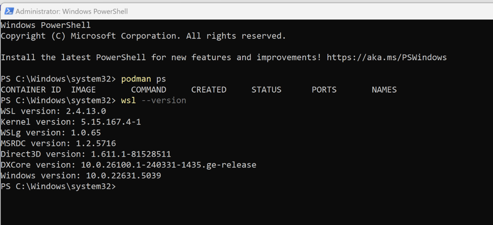
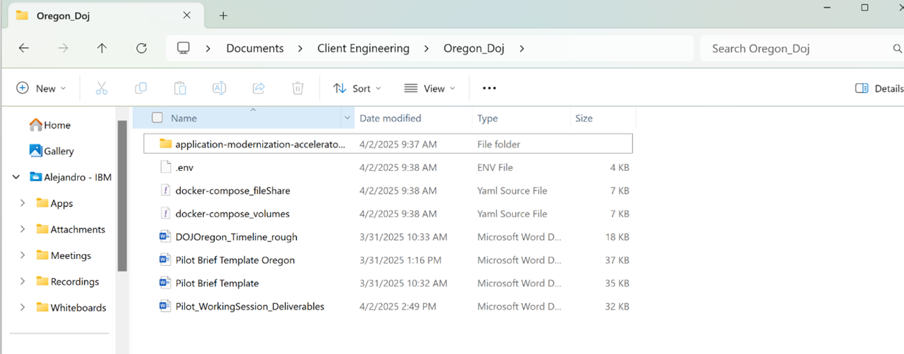
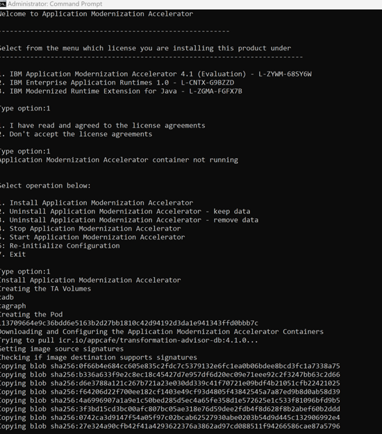
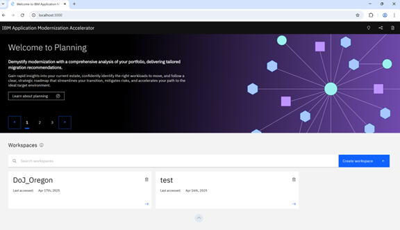
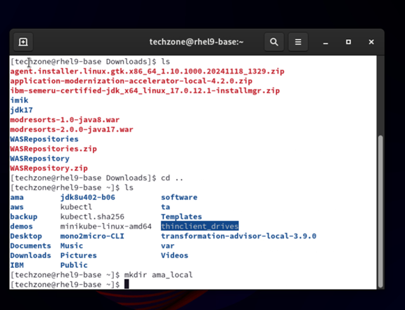
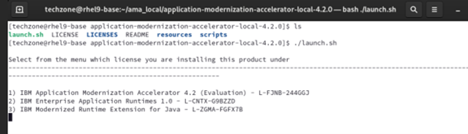
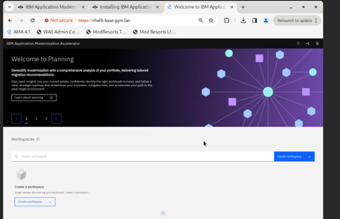

# AMA Installation Guide

Install IBM Application Modernization Accelerator (AMA) on both Windows and RHEL platforms.  
For full details, see the [IBM Application Modernization Accelerator documentation](https://www.ibm.com/docs/en/ama)

---

## Install Tools

### Install AMA

=== "Windows"

    1. **Enable WSL2 & Ubuntu 20.04+**
    
       From PowerShell (as Administrator):
       ```powershell
       wsl --install
       ```
       Reboot if required, then install Ubuntu from the Microsoft Store.  
       

    2. **Install Podman on WSL Ubuntu**

       Follow the official Podman install steps for Ubuntu.

    3. **Download & Unpack AMA**

       - Grab `application-modernization-accelerator-<version>.zip` plus `.env` & `docker-compose.yml` from the IBM Registration Portal.  
       - Extract into your working directory.  
       

    4. **Run the Windows Installer**

       Open a Command Prompt as Administrator and:
       ```cmd
       cd "C:\Users\AlejandroPalumbo\Documents\Client Engineering\Oregon_Doj\application-modernization-accelerator-local-4.1.0\scripts\windowsPodmanDesktop"
       launch.bat
       ```
         
       - Accept the license (press 1)  
       - Choose Option 1 to install AMA  
       Wait for containers to initialize.

    5. **Verify Installation**

       Point your browser at:
       ```
       http://localhost:3000
       ```
       

=== "RHEL"

    1. **Install & Locate Tools**

       Download the AMA archive and unpack to:
       ```bash
       sudo mkdir -p /opt/ama_local
       sudo tar xzf application-modernization-accelerator-<version>.tar.gz -C /opt/ama_local
       ```
       [IBM Application Modernization Accelerator - IBM Documentation](https://www.ibm.com/docs/en/ama){target="_blank"}  
       

    2. **Launch AMA on RHEL**

       ```bash
       cd /opt/ama_local/scripts
       ./launch.sh
       ```
         
       Follow prompts to accept the license and install.  
       

    3. **Download & Unzip Binary Scanner**

       From the AMA UI, download the Binary Scanner and unzip into `/opt/ama_local`.

    4. **Verify Installation**

       Access:
       ```
       http://<your-rhel-host>:3000
       ```

---

## Next Steps

- Getting started in the IBM Application Modernization Accelerator UI  
- Create a workspace  
