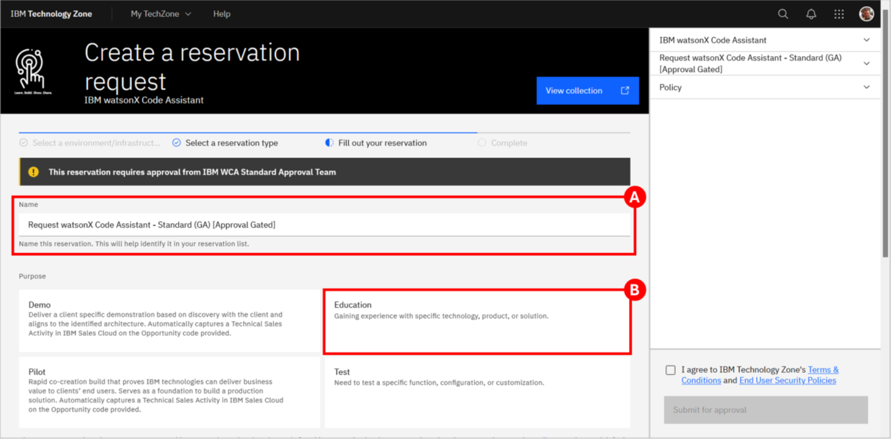
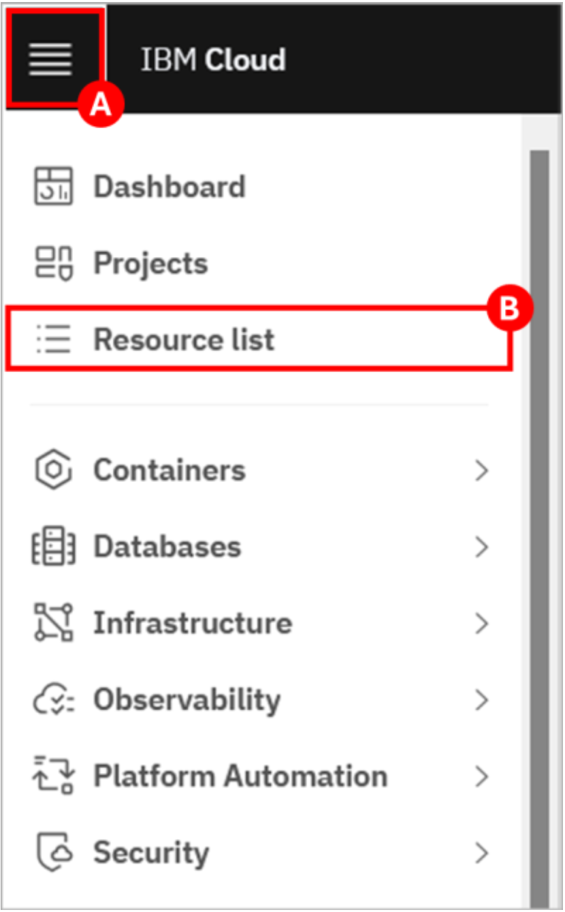
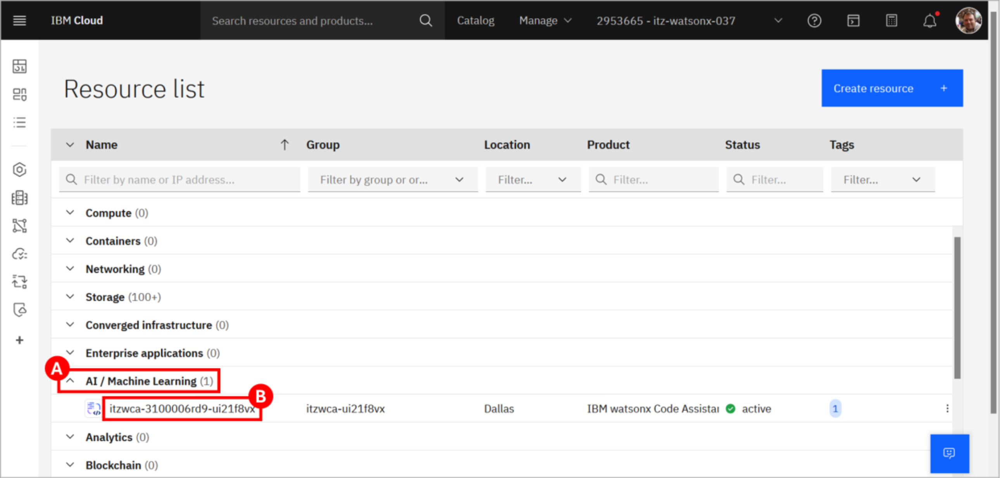
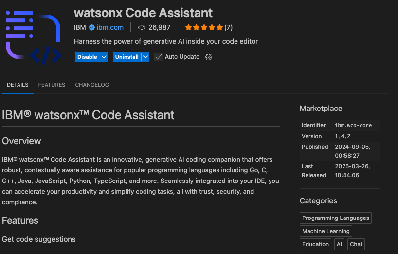
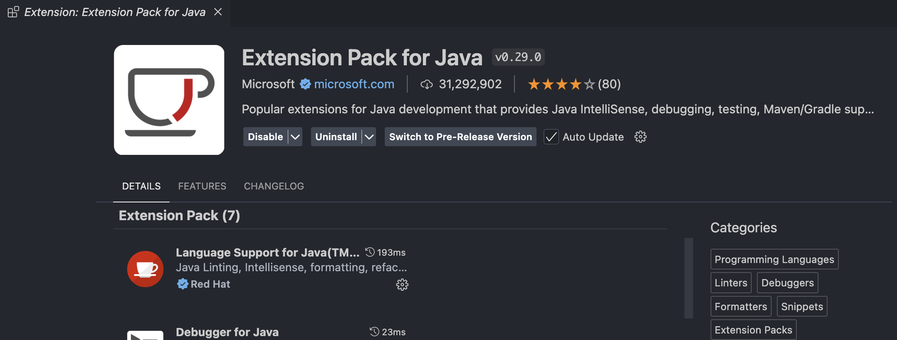

# Hands-on Setup Guide for Watson Code Assistant

The main objective of this lab is to provide hands-on experience with some of the core features and capabilities available to developers in IBM watsonx Code Assistant (WCA). The lab content is loosely organized to align with the capabilities found in the two different plans (editions) available for WCA:

- **Essentials**: This accelerates software development, allowing developers to use WCA with integrated generative AI for coding tasks, including:
  - Generating code  
  - Explaining code  
  - Creating unit tests  
  - Documenting code  

- **Standard**: In addition to all the capabilities found in the Essentials plan, the Standard plan also includes these enterprise Java modernization capabilities:
  - Java upgrades, regardless of runtime  
  - WebSphere to Liberty transformation  
  - Enhanced test generation and code explanation  

After completing this lab, you will have a deeper understanding of what is possible with WCA and will have observed how it can be a powerful tool to help accelerate software development and application modernization.

---

## Prerequisite Installation Steps

As previously mentioned, there are two separate components that make up IBM watsonx Code Assistant (WCA):

1. **WCA service** – This is the back-end software, leveraging generative AI, that services requests from developers. It is available as software-as-a-service (SaaS) on IBM Cloud and as deployable software for on-premises and cloud deployments.  
2. **WCA extension (plug-in)** – Installed in an integrated development environment (IDE) on a developer’s own system, this is how the developer interacts with WCA. It includes a chat interface as well as in-source options for generating, explaining, and documenting code. It can also help drive Java upgrades and WebSphere to Liberty transformation, among other things. The IDEs currently supported by WCA are Visual Studio Code (VS Code) and Eclipse.

> **Tip**  
> To avoid the need for you to set up your own development environment (which would include installation of an IDE, the WCA extension, various other software, and sample source code), a pre-configured environment has been made available for you in IBM Technology Zone (TechZone). Likewise, a WCA service has been made available to you as well, also available through TechZone. However, this lab assists you in setting up your own system to perform the lab on your own system using the TechZone WCA Service as the back-end.

---

## Reserve the TechZone Environment

1. **Open the collection for WCA-related environments in TechZone.** Sign in with your IBMid if prompted.

2. **Locate the “Request watsonX Code Assistant – Standard (GA) [Approval Gated]” tile** and click the **IBM Cloud environment / Reserve it** button (A).  
     
   *Figure 1 – Selecting the WCA – Standard (GA) tile and clicking “Reserve it” (A).*

3. **Accept the default for the reservation Name (A)** or provide a name of your choosing. For the Purpose of the reservation, select **Education** (B).  
     
   *Figure 2 – Providing a reservation name and selecting “Education.”*

4. **Fill in the Purpose description box** with the reason you are making the reservation. Then select your Preferred Geography based on your desired location.  
5. **Adjust the reservation’s Start date and time and End date and time** as needed (note that you can extend your reservation later if you need more time).  
6. **In the lower-right corner, follow the links to read TechZone’s terms, conditions, and security policies**, and then select the checkbox to agree to them.  
7. **Click Submit for approval.** A message in the upper-right corner will briefly appear stating that the reservation has been created.

> **Note**  
> You will receive an email from IBM Technology Zone with a subject of “Request is Pending Approval.” Once it has been approved you will receive another email with a subject of “Request Approved.”  
> When provisioning starts (based on the start time you provided) an email with a subject of “Reservation Provisioning on IBM Technology Zone” is sent. Finally, an email with a subject of “Reservation Ready on IBM Technology Zone” indicates that provisioning has completed.

---

### If You Want a Developer System from TechZone

If you chose not to use your local system as your development environment, follow these steps to provision the pre-configured demonstration environment from TechZone (includes RHEL 9, VS Code w/ WCA extension, Eclipse IDE, OpenJDK 11 & 21, and sample ModResorts application).

1. **Open the collection of WCA-related environments in TechZone.** Sign in with your IBMid if prompted.  
2. **Locate the “watsonx Code Assistant – Demonstration VM” tile** and click the **IBM Cloud environment / Reserve it** button.  
   > _Note: There are multiple tiles listed—ensure you select the correct one._  
3. **For the reservation type, select the “Reserve now” radio button.**  
     
   *Figure 3 – Reserving the “watsonx Code Assistant – Demonstration VM” (Reserve now).*

4. **Accept the default for the reservation Name** or provide a custom name. For the Purpose, select **Education**.  
5. **Fill in the Purpose description box** and then select your Preferred Geography.  
6. **Adjust the reservation’s End date and time** as needed. Leave **VPN Access** set to **Disable**.  
7. **Follow the terms links**, check the agreement box, and click **Submit**.  
     
   *Figure 4 – Agreeing to TechZone terms and submitting.*

8. **Watch for provisioning emails**: “Reservation Provisioning on IBM Technology Zone” and then “Reservation Ready on IBM Technology Zone.”

---

## Workstation Setup

### Java installation

Install Java 21 using the applicable link:

- [Download Java for MacOS – Arm64](https://download.oracle.com/java/21/latest/jdk-21_macos-aarch64_bin.tar.gz)  
- [Download Java for MacOS – x86](https://download.oracle.com/java/21/latest/jdk-21_macos-x64_bin.tar.gz)  
- [Download Java for Windows](https://download.oracle.com/java/21/latest/jdk-21_windows-x64_bin.zip)

All of the above are compressed files; extract them to any folder on your local system.

**Check if Java is installed properly:**

## Check if Java is installed properly

1. **Verify the installation**  
   ```bash
   java --version
   ```

2. **Set up your environment variables**

### macOS
=== "For Mac"
1. **Open your shell config** (`~/.zshrc` or `~/.bash_profile`):  
   ```
   nano ~/.zshrc
   ```
2. **Add these lines** (replace `<java-version>` with your actual folder name):  
   ```
   export JAVA_HOME=/Library/Java/JavaVirtualMachines/<java-version>/Contents/Home
   export PATH=$JAVA_HOME/bin:$PATH
   ```
3. **Save & reload** your shell:  
   ```
   # Ctrl+X, then Y, then Enter
   source ~/.zshrc
   ```
4. **Confirm**:  
   ```
   echo $JAVA_HOME
   ```

### Windows
=== "For Windows"
1. **Open Environment Variables**  
   - Press the Windows key, search for **Edit the system environment variables**, then click **Environment Variables**.

2. **Create `JAVA_HOME`** under **System variables**:  
   ```
   Variable name: JAVA_HOME  
   Variable value: C:\Program Files\Java\<java-version>
   ```

3. **Add Java to your `Path`**  
   - Under **System variables**, select **Path** → **Edit** → **New**, then add:  
     ```
     %JAVA_HOME%\bin
     ```

4. **Open a new PowerShell or Command Prompt** and verify:  
   ```
   java --version
   echo $Env:JAVA_HOME
   ```
# Workstation Setup

## Check if Java is installed properly

1. **Verify the installation**  
   ```bash
   java --version
   ```

2. **Set up environment variables**

=== "macOS"
    **Configure `JAVA_HOME` and `PATH`**

    1. Open your shell config (`~/.zshrc` or `~/.bash_profile`):

        ```bash
        nano ~/.zshrc
        ```

    2. Add these lines (replace `<java-version>`):

        ```bash
        export JAVA_HOME=/Library/Java/JavaVirtualMachines/<java-version>/Contents/Home
        export PATH=$JAVA_HOME/bin:$PATH
        ```

    3. Save & reload:

        ```bash
        # Ctrl+X, then Y, then Enter
        source ~/.zshrc
        ```

    4. Confirm:

        ```bash
        echo $JAVA_HOME
        ```

=== "Windows"
    **Configure `JAVA_HOME` and `Path`**

    1. Open **Environment Variables**  
       (Win-key, **Edit the system environment variables** → **Environment Variables**).

    2. Create `JAVA_HOME` under **System variables**:

        ```
        Variable name: JAVA_HOME
        Variable value: C:\Program Files\Java\<java-version>
        ```

    3. Add Java to `Path`  
       (still under **System variables** → **Path** → **Edit** → **New**):

        ```
        %JAVA_HOME%\bin
        ```

    4. Verify in a new PowerShell or CMD:

        ```powershell
        java --version
        echo $Env:JAVA_HOME
        ```

---

## Install Maven

=== "macOS"
    **Install with Homebrew**

    ```bash
    brew install maven
    ```

    **Verify**

    ```bash
    mvn --version
    ```

=== "Windows"
    **Manual installation**

    1. Download the binary ZIP from the [Maven download page](https://maven.apache.org/download.cgi)  
       (e.g., `apache-maven-3.9.9-bin.zip`).

    2. Extract to `C:\Apache\maven\apache-maven-3.9.9`.

    3. Set `MAVEN_HOME` under **System variables**:

        ```
        MAVEN_HOME=C:\Apache\maven\apache-maven-3.9.9
        ```

    4. Add Maven to `Path`:

        ```
        %MAVEN_HOME%\bin
        ```

    5. Verify:

        ```bash
        mvn --version
        ```

## Configure the TechZone WCA Service

Before you can use **watsonx Code Assistant (WCA)**, complete these three tasks:

1. **Join the IBM Cloud account** that contains your pre-provisioned WCA instance.  
2. **Create an API key** to authenticate the VS Code extension.  
3. **Create a deployment space** — the serving environment for WCA.

---

### 1 · Join the IBM Cloud account

You should have received an email titled **“Action required: You are invited to join an account in IBM Cloud.”**  
If you *didn’t* receive the email, use the reservation portal instead.

=== "Using the invitation email"

1. Open the email and click **Join now**.  
2. Accept the Terms & Conditions, then click **Join account**.  
3. Switch to the new account inside IBM Cloud.

=== "Without the invitation email"

1. Open your TechZone reservation for  
   **watsonx Code Assistant – Standard (GA) [Approval Gated]** and click **Open IBM Cloud environment**.  
2. In the IBM Cloud console, open the **Notifications** panel and locate the invitation for the reservation you just opened.  
3. Click **Join now** → accept the Terms → **Join account** → **Proceed** to switch accounts.


---

### 2 · Create an IBM Cloud API key

> **Important:** do this **in the account you just joined** (e.g. `itz-watsonx-###`).

1. Open **⋮ Manage → Access (IAM)**.  
   

2. In the left sidebar, choose **API keys** and click **Create**.  
   

3. In the pop-up dialog, enter **WCA API key** for **Name** and click **Create**.  
   

4. **Copy or download** the key — you’ll need it when you sign in to the VS Code extension.

---

### 3 · Create a deployment space

1. From the IBM Cloud console, open **☰ Navigation menu → Resource list**.  
   

2. Expand **AI / Machine Learning**. Locate and click your WCA instance (name starts with `itzwca-`).  
   

3. At the bottom of the service page, click **Launch watsonx Code Assistant**.  
   Log in if prompted.

4. In the dialog that appears, ensure **Single user** is selected, then in **Steps to complete** click  
   **▶ Create a deployment space**.  
   

5. Fill in the form:  

   * **Name** – for example *WCA deployment space* (must be globally unique).  
   * **Code assistant service** – pick **your** WCA instance.  
   * **Storage service** – pick the object-storage instance whose name starts with `itzcos` and shares the same identifier.

   Click **Create**.

6. After the space is created, close the dialog. The step now shows as complete.

7. Click **▶ Select your license preference for response generation**.  
   A new tab opens — review if you wish, **do not change anything**, then close the tab.

8. Manually tick **Select your license preference for response generations**, then click **Go to home page**.  
     
   

You’re done! WCA is configured and ready to use from the VS Code extension.

---

## Install and Configure Visual Studio Code

### 1 · Install VS Code

Download and install VS Code from the official site:  
[VSCode Official Website](https://code.visualstudio.com/download)

### 2 · Add the *watsonx Code Assistant* extension

1. Open VS Code and go to **View → Extensions** (or press&nbsp;`Ctrl + Shift + X`).  
2. In the Marketplace search box, type **watsonx Code Assistant**.  
3. Click **Install**.



---

### 3 · Sign in to the WCA service

After installing the extension, you must authenticate with the API key you created earlier.

1. Click **Sign in to WCA** in the lower-left Status Bar.  
2. Paste your API key and press **Enter**.  
   *The number badge on the WCA icon disappears when sign-in succeeds.*


> **Troubleshooting**  
> If you see **“Administrator needs to associate you with a deployment space”**, ask the IBM team to attach your API key to a deployment space and try again.


---

### 4 · Install the *watsonx Code Assistant for Enterprise Java Applications* extension

1. In **Extensions**, search for **watsonx Code Assistant for Enterprise Java Applications**.  
2. Click **Install**.


---

### 5 · Install Liberty Tools and the Java Extension Pack

1. Search **Liberty Tools** and click **Install**.  
   

2. Search **Extension Pack for Java** and click **Install**.  
   

---

### 6 · Start using WCA

Open the **watsonx Code Assistant** side-panel and begin a chat to confirm everything is working:


You’re now ready to generate, explain, and refactor Java code with watsonx Code Assistant in VS Code.
